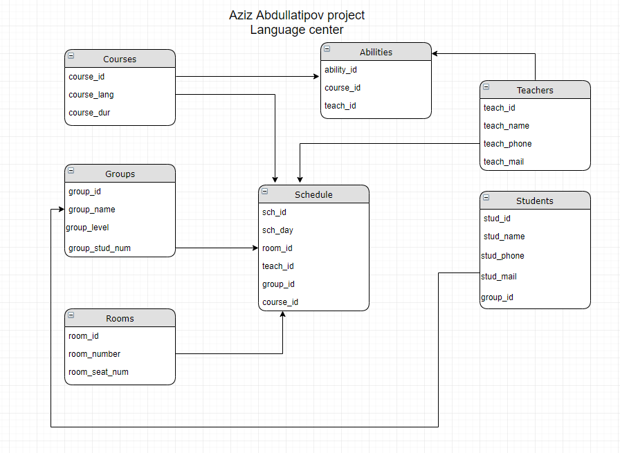

My project is implementation of Language center working process 
About holding information of its employees, customers and courses that they can study
Further I will add Moderator model and to get access to my project from browster you will have to login first

